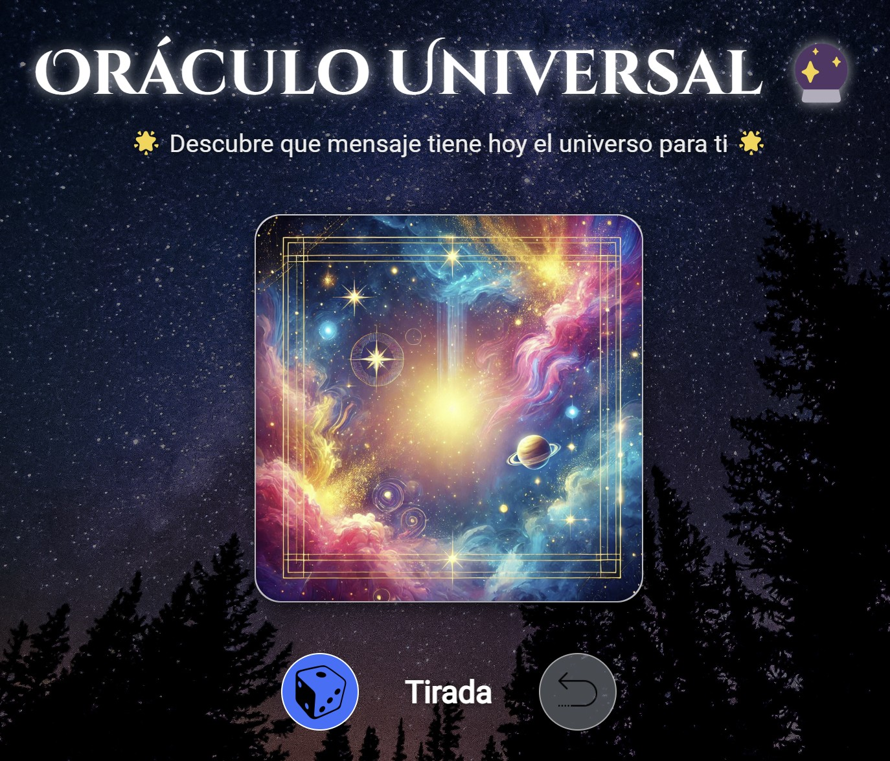

# Oráculo Universal

## 📜 Descripción

**Oráculo Universal** es una aplicación web interactiva diseñada para ofrecerte mensajes diarios del universo. A través de una elegante interfaz y animaciones cautivadoras, esta aplicación te permite descubrir el mensaje que el cosmos tiene para ti cada día. Ideal para quienes buscan inspiración, guía o simplemente una experiencia mágica diaria.

## 🚀 Características

- **Interfaz Intuitiva:** Diseño limpio y atractivo que facilita la interacción.
- **Animaciones Profesionales:** Efectos de balanceo y giro en la carta para una experiencia envolvente.
- **Mensajes Aleatorios:** Amplia colección de mensajes que se actualizan diariamente.
- **Responsiva:** Optimizada para dispositivos móviles, asegurando una experiencia fluida en cualquier pantalla.
- **Fácil de Compartir:** Implementado en GitHub Pages, accesible desde cualquier lugar con una URL sencilla.

## 🎥 Demo

Puedes ver y probar la aplicación en vivo a través del siguiente enlace:

[https://judith166.github.io/oraculo-universal/](https://judith166.github.io/oraculo-universal/)

## 🛠️ Tecnologías Utilizadas

- **HTML5:** Estructura semántica del contenido.
- **CSS3:** Estilos y animaciones personalizadas.
- **JavaScript:** Funcionalidad interactiva y manejo de eventos.
- **Bootstrap 5:** Framework CSS para diseño responsivo y componentes.
- **GitHub Pages:** Hospedaje gratuito para sitios estáticos.
- **Font Awesome (opcional):** Iconografía utilizada en la aplicación.
